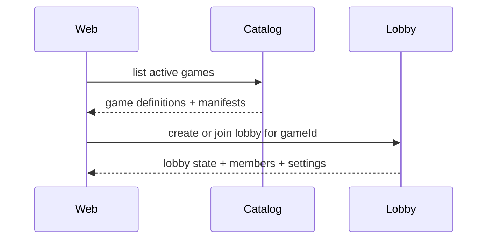
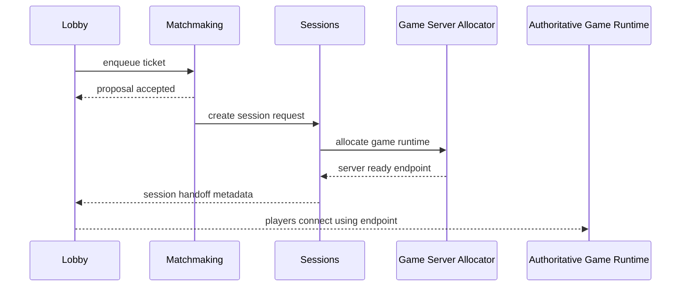
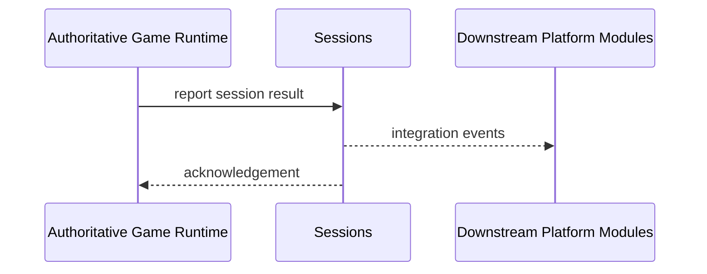

# Platform Domain Model

Status: Accepted source of truth for Foundation Slice 1.1 domain modeling

## Module Classification

| Module | Classification | Scope in Phase 1 |
| --- | --- | --- |
| Auth | Boundary placeholder | Identity boundary only. No meaningful implementation beyond status until authentication use cases arrive. |
| Players | Boundary placeholder | Player profile ownership boundary only. No persistence work in this slice. |
| Social | Boundary placeholder | Friends, parties, and presence boundary only. No persistence work in this slice. |
| Catalog | Active domain seed | Canonical game definitions, manifests, versions, and capabilities. |
| Lobby | Active domain seed | Pre-session room lifecycle, members, readiness, visibility, and launch intent. |
| Matchmaking | Active domain seed | Queue membership, ticket lifecycle, proposals, and match creation. |
| Sessions | Active domain seed | Session metadata, participant roster, connection handoff, result envelope, and game-server allocation orchestration. |

The intent is explicit: Phase 1 keeps boundary shells only where the business capability is not yet active, while the gameplay-adjacent flow is modeled now as real domains even with in-memory repositories.

## Domain Separation Rules

- `Catalog` owns what a game is and which platform capabilities it advertises.
- `Lobby` owns how a group prepares to launch a game.
- `Matchmaking` owns how queued demand becomes a match.
- `Sessions` owns post-match metadata and handoff to an authoritative game runtime.
- `Game Server Allocation` is a subdomain of `Sessions`, not a separate top-level module in Phase 1.
- Platform services never own gameplay state, win logic, or simulation state.
- Platform APIs return domain-safe identifiers, metadata, and error codes rather than translated user messages.

## Catalog Domain

### Aggregates and Value Objects

- `GameDefinition`: product-facing catalog identity and lifecycle status.
- `GameManifest`: integration-facing read projection assembled for clients from persisted catalog records.
- `GameVersion`: compatibility tuple for game, protocol, and build versions.
- `GameCapabilities`: declared support for multiplayer, ranking, spectators, replays, and private rooms.
- `GamePlatformAvailability`: advertised platform matrix for the active catalog version.
- `GameDistributionMetadata`: minimum supported platform version plus launch and distribution strategy metadata.
- `GameRuntime`: client runtime, engine family, and server topology.

### Read Model Shape

- `GameDefinition` owns canonical identity, lifecycle state, category, and semantic localization keys.
- `GameVersion` owns the active compatibility tuple and runtime description.
- `GameCapabilities`, `GamePlatformAvailability`, and `GameDistributionMetadata` hang off the active catalog version.
- `GameManifest` remains the wire-level shape returned to platform clients, but it is a projection rather than the persistence root.

### Invariants

- `gameId` is the canonical integration identifier.
- `slug` is stable for web navigation and operator-facing routing.
- `GameManifest.version` must be present before a title becomes `active`.
- catalog metadata must carry platform availability and future distribution strategy fields.
- `GameCapabilities.multiplayer = true` implies server allocation and session flows are defined, even if the allocator implementation is stubbed in DEV.
- exactly one active catalog version may exist per `gameId` at a time.
- semantic localization keys are persisted as keys only; translated strings remain in the shared i18n bundles.

### Persistence Classification

- Persistent in PostgreSQL: `GameDefinition`, active and historical `GameVersion` rows, version-scoped capabilities, platform availability, and distribution metadata.
- Implementation shape: normalized relational tables joined into the manifest read model through the catalog repository.
- Seed strategy: deterministic idempotent seed data is allowed for DEV, integration tests, and smoke validation so long as the live API still reads from PostgreSQL.
- Ephemeral: none required for baseline catalog reads.

## Lobby Domain

### Aggregates and Value Objects

- `Lobby`: aggregate root for pre-session coordination.
- `LobbyMember`: player or spectator membership entry.
- `LobbySettings`: visibility, capacity, region, and custom launch settings.
- `LobbyState`: `forming -> open -> ready-check -> allocated -> in-session -> closing -> closed`.
- `LobbyVisibility`: `public | private | friends-only | invite-only`.
- `LobbyRole`: `host | member | spectator`.
- `ReadyState`: `pending | ready | not-ready`.

### Invariants

- Every lobby has exactly one host at a time.
- `members.length <= settings.maxPlayers` for player seats.
- `state = ready-check` requires at least `settings.minPlayers` joined.
- `state = allocated` requires either a direct session allocation or an accepted matchmaking outcome.
- `sessionId` is absent until the lobby transitions into `allocated` or `in-session`.

### Persistent vs Ephemeral

- Persistent later in PostgreSQL: lobby identity, ownership, settings, audit timeline.
- Ephemeral in Redis later: short-lived ready checks, countdowns, invite tokens, transient seat locks.

## Matchmaking Domain

### Aggregates and Value Objects

- `MatchmakingTicket`: the unit of demand entering matchmaking.
- `MatchmakingQueue`: queue configuration for a game and playlist.
- `MatchCandidate`: a scored candidate set of tickets before proposal.
- `MatchProposal`: acceptance window for a candidate.
- `Match`: durable record that a candidate became a launchable match.

### Ticket Lifecycle

`queued -> searching -> proposed -> matched`

Exit states:

- `cancelled`
- `expired`

### Modeling Notes

- Quick play should create temporary platform-managed matchmaking demand, not a full lobby first.
- Party matchmaking may reference an existing lobby or party aggregate later, but the queue ticket remains the matchmaking-owned unit.
- Matchmaking state is primarily ephemeral and coordination-heavy, so Redis is the expected backing store later.

### Persistent vs Ephemeral

- Ephemeral in Redis later: queues, active tickets, proposals, scoring windows.
- Persistent later in PostgreSQL: accepted matches, operator audits, player-visible history if needed.

## Sessions Domain

### Aggregates and Value Objects

- `GameSession`: metadata record for a launched play session.
- `SessionParticipant`: player or spectator attached to the session.
- `SessionEndpoint`: connection handoff returned to clients.
- `SessionState`: `allocating -> ready -> active -> ending -> completed | terminated | failed`.
- `SessionResult`: envelope reported by the authoritative game runtime.

### Match vs Session Distinction

- A `Match` is the matchmaking outcome that says who should play.
- A `GameSession` is the runtime instance that says where and how they play.
- Not all sessions come from matchmaking. Private lobbies may allocate a session directly.

### Persistent vs Ephemeral

- Persistent later in PostgreSQL: session identity, participants, version tuple, allocation references, result envelope.
- Ephemeral in Redis later: reconnect tokens, transient connection handoff state, live presence markers.

## Game Server Allocation Subdomain

### Core Types

- `GameServerAllocationRequest`
- `GameServerAllocation`
- `AllocatorDescriptor`

### Ownership Rules

- Allocation orchestration belongs to `Sessions`.
- Actual game runtime provisioning belongs to the allocator implementation.
- DEV may use a future `docker-dev` allocator.
- Production is expected to use a Kubernetes/Agones-backed allocator via ADR.

### Current Phase 1 Rule

- keep allocator as an interface plus no-op DEV implementation
- do not implement real Docker or Kubernetes provisioning in this slice

## Sequence Diagrams

### Catalog to Lobby Launch

### Matchmaking to Session Allocation

### Result Reporting

## Failure Ownership Matrix

| Failure | Owning Domain | Notes |
| --- | --- | --- |
| Game manifest missing or incompatible version | Catalog | launch blocked before lobby launch |
| Lobby host disconnects before allocation | Lobby | lobby ownership reassignment or closure |
| Queue proposal expires | Matchmaking | ticket returns to queue or expires |
| Allocator fails to provision server | Sessions | session enters failed state and lobby receives retry or error surface |
| Runtime never reports heartbeat | Sessions | session marked unhealthy and escalated to allocator or operators |
| Result payload invalid for contract version | Sessions | reject envelope and preserve session for retry or termination |

## Idempotency Requirements

- `enqueue matchmaking ticket`: idempotent by client request key or lobby ticket key.
- `accept proposal`: idempotent by `proposalId + ticketId`.
- `create session from match`: idempotent by `matchId`.
- `allocate server`: idempotent by `sessionId`.
- `report result`: idempotent by `sessionId + reportedAt` or a runtime-issued report identifier.
- `terminate session`: idempotent by `sessionId`.

## Integration Event Catalog

- `catalog.game-published`
- `lobby.created`
- `lobby.ready-check-completed`
- `matchmaking.ticket-queued`
- `matchmaking.match-created`
- `sessions.session-created`
- `sessions.session-ready`
- `sessions.result-reported`
- `sessions.session-terminated`