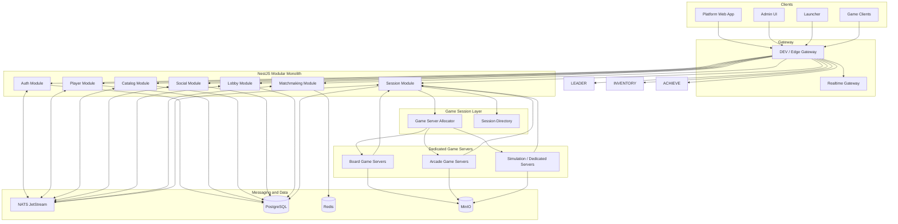

# System Overview

Status: Accepted source of truth for the Architecture/Foundation phase

## Purpose

Game Center is a platform, not a bundle of web mini-games.

This document is also constrained by mandatory architecture invariants for localization, design tokens, platform targets, automated testing, and shared-code boundaries.

Game client architecture decisions for production titles are defined in `docs/architecture/game-client-architecture.md`. Prototype game clients under `games/prototypes/` are reference assets only and must not be hardened into production architecture.

The platform owns cross-game capabilities such as identity, social graph, lobbying, matchmaking, session metadata, achievements, rankings, inventory, chat, moderation, notifications, telemetry, and administration.

Each game is an independent game product that integrates with the platform through explicit contracts and SDKs. The platform must not dictate the game engine or gameplay server technology beyond the approved architecture rules.

## Phase 1 Platform Architecture

Phase 1 uses a modular monolith for platform business domains.

```text
React Web
  |
  v
DEV Gateway
  |
  v
Platform API - NestJS Modular Monolith
  |- Auth Module
  |- Player Module
  |- Catalog Module
  |- Social Module
  |- Lobby Module
  |- Matchmaking Module
  '- Session Module
```

Each module is a real domain boundary, but all modules run inside one NestJS runtime during Phase 1.

Current Slice 1.1 module classification:

| Module | Classification | Why |
| --- | --- | --- |
| Auth | Boundary placeholder | reserved boundary for identity and authentication, no game-center-specific domain behavior yet |
| Players | Boundary placeholder | reserved boundary for player profile ownership, no active use cases yet |
| Catalog | Active persisted domain | owns game definitions, manifest projections, version metadata, and capability discovery |
| Social | Boundary placeholder | reserved boundary for parties, presence, and graph ownership |
| Lobby | Active domain seed | owns room lifecycle, membership, readiness, and launch preparation |
| Matchmaking | Active domain seed | now models queues, tickets, proposals, and match creation as in-memory seeds |
| Sessions | Active domain seed | now models session lifecycle and game-server allocation orchestration as in-memory seeds |

Detailed invariants, state machines, event catalog, and ephemeral vs persistent ownership for these domains live in `docs/architecture/platform-domain-model.md`.

## Architectural Principles

### Platform is not game logic

Platform services may know:

- player identity
- lobby membership
- party composition
- matchmaking requests
- session metadata
- connection handoff
- match result envelopes

Platform services may not know:

- win detection rules
- authoritative gameplay state
- simulation physics
- game AI
- gameplay-specific persistence layout

### Server authoritative multiplayer

For every multiplayer game:

- clients send intent, input, or commands
- authoritative game servers validate and mutate state
- platform services receive session and result metadata only

### Controlled polyglot model

Default language and runtime choices are fixed unless an ADR approves an exception.

| Concern | Default Decision |
| --- | --- |
| Platform web | React + TypeScript + Vite + React Router + TanStack Query |
| Desktop platform shell | Tauri 2 |
| Mobile platform shell | React Native + Expo + TypeScript |
| Platform business runtime | NestJS + TypeScript modular monolith |
| Realtime gateway | Go |
| Board / turn-based authoritative servers | Go |
| Board game clients | Web or Godot depending on title |
| Web arcade clients | Phaser, PixiJS, or Godot unless a different engine is justified by ADR |
| High-end 3D / simulation | Unreal Engine 5 + C++ / Blueprints |
| Browser 3D preview | Three.js only for preview / visualization / prototype use |
| Database | PostgreSQL + Drizzle ORM in platform-api |
| Cache / ephemeral state | Redis |
| Messaging | NATS JetStream |
| Object storage | MinIO in DEV, S3-compatible in production |

## Current Catalog Runtime

- Catalog reads are now served from PostgreSQL through the `Catalog` module repository boundary.
- The public read surface is `GET /api/games` and `GET /api/games/:slug`.
- The platform web app no longer falls back to a local preview catalog at runtime when the live service is unavailable.
- DEV and CI are expected to run `npm run db:migrate` and `npm run db:seed` before smoke or integration flows that depend on catalog data.

## Target System Diagram



## Repository Target Structure

```text
game-center/
├── apps/
│   ├── web/
│   ├── desktop/
│   ├── mobile/
│   └── admin/
├── services/
│   ├── platform-api/
│   └── realtime-gateway/
├── games/
│   ├── prototypes/
│   └── production/
├── packages/
│   ├── contracts/
│   ├── platform-sdk-ts/
│   ├── i18n/
│   ├── design-tokens/
│   ├── ui/
│   ├── config/
│   ├── observability/
│   ├── testing/
│   └── utilities/
├── infrastructure/
│   ├── docker/
│   ├── monitoring/
│   └── scripts/
└── docs/
```

## Platform Layer Responsibilities

Platform modules inside `services/platform-api` own:

- authentication
- player profiles
- friends and parties
- presence routing
- game catalog and game manifest discovery
- game lobby and matchmaking metadata
- session metadata and allocation orchestration
- achievements, rankings, inventory, tournaments
- notifications, chat, moderation
- telemetry, observability, and administration

## Game Layer Responsibilities

Game products own:

- game rules
- game state
- gameplay networking
- simulation / physics
- AI
- authoritative result generation
- replays and game-specific persistence

Production game clients must also preserve internal client boundaries between bootstrap, domain, state, systems, input, rendering, UI, localization, platform adapter, and tests.

## Platform-to-Game Contract Model

Every game product integrates through versioned contracts and manifests.

### Required game manifest shape

```json
{
  "id": "chess",
  "name": "Chess",
  "category": "board",
  "runtime": "web",
  "engine": "custom",
  "serverType": "dedicated",
  "supports": {
    "multiplayer": true,
    "ranked": true,
    "spectators": true,
    "replays": true,
    "privateRooms": true
  }
}
```

### Required session version fields

- `gameId`
- `gameVersion`
- `protocolVersion`
- `buildVersion`

### Baseline lifecycle

```text
Player
  -> Game Lobby
  -> Matchmaking
  -> Match Created
  -> Game Session Created
  -> Game Server Allocated
  -> Connection Data Returned
  -> Game Starts
  -> Result Reported
  -> Session Closed
  -> Downstream stats / leaderboard / achievements update
```

### Core platform-to-game operations

- `CreateSession`
- `JoinSession`
- `LeaveSession`
- `PlayerReady`
- `StartMatch`
- `Heartbeat`
- `Reconnect`
- `EndMatch`
- `ReportResult`
- `TerminateSession`

## Data Ownership Rules

Each platform module owns its data boundary. Cross-module reads must occur through application interfaces, queries, events, projections, or dedicated read models, never by querying another module's tables directly.

Phase 1 uses one PostgreSQL instance with logical ownership preserved through module-specific schemas or equivalent naming conventions such as:

- `auth.*`
- `players.*`
- `catalog.*`
- `social.*`
- `lobby.*`
- `matchmaking.*`
- `sessions.*`

## DEV Infrastructure Rules

- Docker-first local development
- one external developer entry point via gateway
- default `docker compose up` starts a usable development stack
- service-to-service networking via Docker DNS, never `localhost`
- bind mounts and watchers for hot reload
- PostgreSQL as primary state store
- Redis for cache / ephemeral coordination only
- NATS JetStream for event integration
- MinIO for object storage
- OpenTelemetry from day one
- health endpoints at `/health/live` and `/health/ready`

## Internationalization And UI Architecture Rules

- all user-facing text must come from translation files
- RTL and LTR are first-class architecture requirements
- semantic design tokens are the only valid source for shared visual values
- apps must not import other apps directly for UI reuse

Supporting source-of-truth docs:

- `docs/architecture/frontend-architecture.md`
- `docs/architecture/localization.md`
- `docs/architecture/design-system.md`
- `docs/architecture/testing-strategy.md`
- `docs/architecture/platform-targets.md`

## Prototype Policy

Current prototype clients remain valuable references for interaction and visual direction. They are not automatically promoted into production architecture.

- `games/prototypes/board-arena` remains prototype-only.
- `games/prototypes/arcade-runner` remains prototype-only.
- `games/prototypes/flight-sim` remains prototype-only and should be treated as a browser preview/reference, not the long-term implementation for a full-scale simulation product.

## Internal Platform API Layering

Each module inside the modular monolith must preserve internal boundaries:

```text
HTTP / WebSocket
  v
Application
  v
Domain
  v
Repository Interface
  v
Infrastructure
```

The domain layer must not depend on NestJS controllers, PostgreSQL clients, Redis clients, NATS clients, or HTTP transport types.

## Monorepo Tooling

Phase 1 keeps `npm workspaces` as the monorepo tool.

Rationale:

- already present in the repository
- sufficient for the current workspace count
- avoids premature Nx or Turborepo complexity

## Enforcement Rules

1. No game-specific rules inside platform services.
2. No new language without an ADR.
3. No new game integration without a manifest and versioned contract.
4. No direct service-to-service database access.
5. No local-development dependency on host-installed PostgreSQL, Redis, NATS, or observability tools.
6. No production assumptions embedded in prototype gameplay clients.