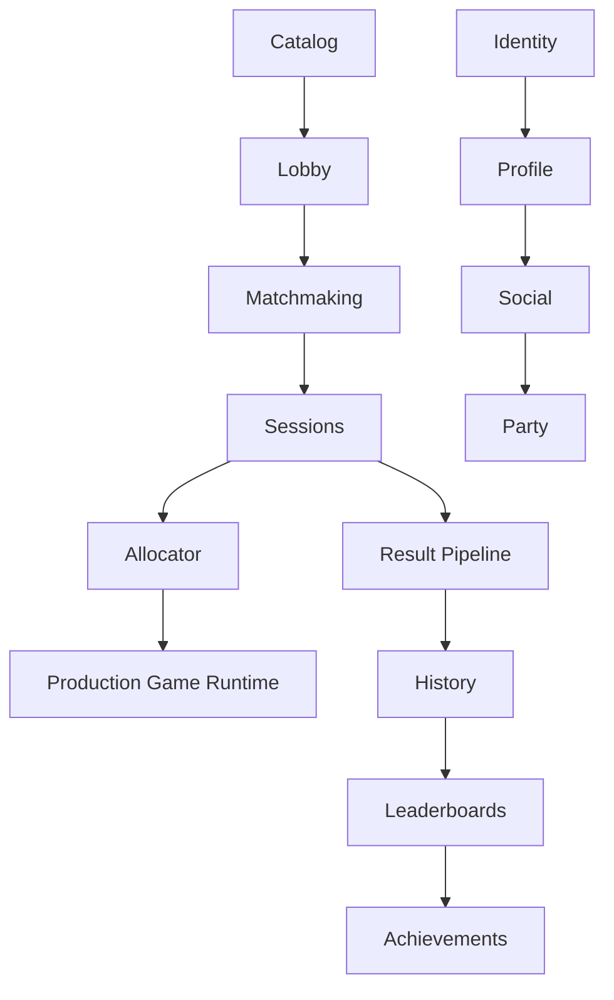

# Master Platform Roadmap

## Permanent Governance Rule

Before starting any implementation task, read `docs/roadmap/master-platform-roadmap.md`.

Work only on the current `READY` or explicitly `IN_PROGRESS` phase.

Do not pull work from future phases unless it is strictly necessary to satisfy the current phase's contract. Any such dependency must be documented first.

Discoveries must be classified as `BLOCKER`, `NEXT_PHASE`, `PLANNED_LATER`, or `NOT_PLANNED`.

A newly discovered idea is not permission to implement it.

This is a permanent project rule.

## Phase Prompt Header

Before doing any implementation:

1. Read `docs/roadmap/master-platform-roadmap.md`.
2. Confirm the target phase is `READY` or `IN_PROGRESS`.
3. Read that phase's dependencies and non-goals.
4. Read applicable ADRs and contract docs.
5. Do not implement future-phase work.
6. Classify new discoveries as `BLOCKER`, `NEXT_PHASE`, `PLANNED_LATER`, or `NOT_PLANNED`.
7. Stop when the phase's exit criteria are met.

## Roadmap Status Model

Every phase uses exactly one status:

- `NOT_STARTED`: Dependencies are not yet complete.
- `READY`: All entry criteria are satisfied and the phase may begin.
- `IN_PROGRESS`: This is the active implementation phase.
- `BLOCKED`: Work began or was eligible to begin but cannot progress due to a concrete blocker.
- `DONE`: All exit criteria and quality gates are complete.
- `DEFERRED`: Intentionally postponed by an explicit architectural or product decision.

Only one major platform foundation phase should normally be `IN_PROGRESS` at a time unless the roadmap explicitly permits parallel tracks.

## Discovery Classification

### BLOCKER

Required to make the current phase correct or safely complete.

Must be resolved before the phase closes.

### NEXT_PHASE

Belongs directly to the immediately following approved phase.

Record it but do not implement it now.

### PLANNED_LATER

Already has a place in this roadmap.

Record the finding under the relevant future phase.

### NOT_PLANNED

Outside the approved roadmap.

Do not implement without a new explicit decision.

## Source Of Truth Hierarchy

- Roadmap: what, when, dependencies, status.
- ADR: why an architectural decision was made.
- Architecture docs: how the current system is structured.
- Contract docs: exact behavior and interfaces.
- Runbooks: how to operate, deploy, and test the system.

## Current Program State

The repository currently proves:

- Architecture / Foundation: `DONE`
- Game Client Architecture Foundation: `DONE`
- Catalog: `DONE`
- Lobby: `DONE`
- Matchmaking: `DONE`
- Session Lifecycle: `DONE`

No future phase is treated as complete unless the repository and existing documentation prove it.

## Phase Index

| Phase | Status | Depends On | Summary |
| --- | --- | --- | --- |
| P00 Foundation | DONE | none | Foundation platform architecture and baseline persisted domains. |
| P01 Session Lifecycle | DONE | P00 | Durable session lifecycle after match acceptance. |
| P02 GameServerAllocator Abstraction | DONE | P01 | Provider-neutral allocation contract. |
| P03 Docker DEV Game Allocator | DONE | P02 | First real session-to-server allocation flow. |
| P04 Realtime Gateway | DONE | P01, P03 | Authenticated realtime transport and subscriptions. |
| P05 Authentication & Identity | READY | P04 | Replace transitional identity paths. |
| P06 Player Profile | NOT_STARTED | P05 | Player-owned public and private profile data. |
| P07 Social Graph | NOT_STARTED | P05, P06 | Friends, blocks, presence eligibility. |
| P08 Party System | NOT_STARTED | P07 | Party lifecycle distinct from Lobby. |
| P09 Platform Game SDKs | NOT_STARTED | P05, P10 | Consumer-facing platform integration SDKs. |
| P10 Authoritative Result Pipeline | NOT_STARTED | P01, P03, P05 | Server-authenticated result ingestion and validation. |
| P11 First Production Game | NOT_STARTED | P10, P34, P35 | Lock first production game program and architecture. |
| P12 Production Board Arena | NOT_STARTED | P11 | First production-complete game implementation. |
| P13 Match History & Player Statistics | NOT_STARTED | P10, P12 | Durable history and per-game stats. |
| P14 Leaderboards | NOT_STARTED | P10, P13 | Authoritative ranking surfaces. |
| P15 Achievements | NOT_STARTED | P10, P13 | Unlocks and progress model. |
| P16 Notifications | NOT_STARTED | P04, P05 | In-app and realtime notifications. |
| P17 Chat | NOT_STARTED | P05, P07, P16, P22 | Moderated communication channels. |
| P18 Replay & Spectating | NOT_STARTED | P10, P12 | Replay storage and spectator access. |
| P19 Inventory & Cosmetics | NOT_STARTED | P05, P09 | Ownership and equip state. |
| P20 Store / Economy | NOT_STARTED | P19 | Ledger-first economy and commerce. |
| P21 Tournaments | NOT_STARTED | P10, P12 | Tournament flow on stable sessions and results. |
| P22 Moderation & Trust | NOT_STARTED | P05, P07, P17 | Reports, sanctions, evidence, audit. |
| P23 Admin / Control Room | NOT_STARTED | P22, P24 | Operational surfaces across live domains. |
| P24 Observability Maturity | NOT_STARTED | P00 | Mature metrics, traces, and service health insight. |
| P25 Security Hardening | NOT_STARTED | P05, P10, P24 | Dedicated threat and control hardening. |
| P26 Data Lifecycle & Privacy | NOT_STARTED | P05, P13, P17, P18, P20 | Retention, deletion, export, backup, restore. |
| P27 Performance / Scale Baseline | NOT_STARTED | P12, P24 | Measure before extraction. |
| P28 Production Deployment Architecture | NOT_STARTED | P25, P26, P27 | Real production runtime and rollout architecture. |
| P29 Desktop Client | NOT_STARTED | P05, P09, P31 | Tauri platform shell. |
| P30 Mobile Client | NOT_STARTED | P05, P09, P31 | React Native + Expo platform shell. |
| P31 Platform Distribution Model | NOT_STARTED | P09, P28 | Catalog-driven install and launch matrix. |
| P32 Production Arcade Game | NOT_STARTED | P10, P31, P34, P35 | Production arcade title beyond prototype. |
| P33 Production High-End 3D Game | NOT_STARTED | P10, P28, P31, P34, P35 | Production native 3D title beyond prototype. |
| P34 Game Engine Decision Framework | NOT_STARTED | P09 | Reusable engine decision matrix. |
| P35 Game Production Pipeline | NOT_STARTED | P09, P10 | Standardized game delivery lifecycle. |
| P36 Content / Asset Pipeline | NOT_STARTED | P35 | Asset packaging, storage, and delivery. |
| P37 Feature Flags & Remote Configuration | NOT_STARTED | P05, P24, P28 | Rollouts, kill switches, minimum versions. |
| P38 QA / Certification | NOT_STARTED | P12, P29, P30, P31 | Full cross-platform quality program. |
| P39 Beta Program | NOT_STARTED | P28, P38 | Structured alpha/beta operations. |
| P40 Production Launch | NOT_STARTED | P12, P28, P38, P39 | Explicit launch gate and operational readiness. |
| P41 Post-Launch Scale / Service Extraction | DEFERRED | P40 | Extraction only after measured pressure. |

## Critical Path

Default critical path:

```text
P01 Session Lifecycle
-> P02 GameServerAllocator Abstraction
-> P03 Docker DEV Game Allocator
-> P04 Realtime Gateway
-> P05 Authentication & Identity
-> P06 Player Profile
-> P07 Social Graph
-> P08 Party System
-> P09 Platform Game SDKs
-> P10 Authoritative Result Pipeline
-> P11 First Production Game
-> P12 Production Board Arena
-> P13 Match History & Player Statistics
-> P14 Leaderboards
-> P15 Achievements
-> P16 Notifications
-> P17 Chat
-> P18 Replay & Spectating
-> P19 Inventory & Cosmetics
-> P20 Store / Economy
-> P21 Tournaments
-> P22 Moderation & Trust
-> P23 Admin / Control Room
-> P24 Observability Maturity
-> P25 Security Hardening
-> P26 Data Lifecycle & Privacy
-> P27 Performance / Scale Baseline
-> P28 Production Deployment Architecture
-> P29 Desktop Client
-> P30 Mobile Client
-> P31 Platform Distribution Model
-> P32 Production Arcade Game
-> P33 Production High-End 3D Game
-> P38 QA / Certification
-> P39 Beta Program
-> P40 Production Launch
```

Supporting tracks join where needed:

- `P34 Game Engine Decision Framework` must be complete before major production-game architecture locks.
- `P35 Game Production Pipeline` must exist before multiple production games move beyond isolated implementation.
- `P36 Content / Asset Pipeline` must mature before content-complete and release-candidate gates.
- `P37 Feature Flags & Remote Configuration` must land before serious beta and launch operations.

## Parallelization Rules

- Documentation and UX exploration may happen ahead of implementation, but may not redefine architecture contracts.
- Game art and content may progress while platform backend work continues, but production integration waits on SDK and session contracts.
- Desktop and mobile shell exploration may begin before full feature parity, but must not replace the web contracts as the source of truth.
- Supporting program tracks may proceed only when they do not force premature architectural decisions on the current critical-path phase.
- Tightly coupled architectural work should not be parallelized simply to increase activity.

## Dependency Graph



## Platform Definition Of Done

The platform is considered full-platform only when it includes:

- accounts and authentication
- player profiles
- friends and social
- parties
- catalog
- lobby
- matchmaking
- sessions
- game-server allocation
- realtime
- notifications
- chat
- authoritative results
- match history and statistics
- leaderboards
- achievements
- replays
- spectating
- inventory
- store and economy
- tournaments
- moderation
- admin and control room
- web client
- Windows and macOS clients
- Android, iPhone, and iPad clients
- observability
- security
- CI and CD
- backup and restore
- production deployment
- feature flags
- at least three production-complete games

Once that condition is met, the project exits foundation and platform-build mode and enters continuous product development.

## Roadmap Change Policy

Roadmap changes are allowed, but they must be explicit.

For any significant roadmap change, document:

- what changed
- why it changed
- dependency impact
- phase-order impact
- which future work moved

Never silently reorder phases during implementation.

## Phase Details

### P00 Foundation

Status: `DONE`

Purpose:

- Establish the architectural and runtime foundation for the platform.

Depends On:

- none

Entry Criteria:

- repository reset and architecture direction approved

Scope:

- architecture reset
- modular monolith
- Docker-first DEV
- PostgreSQL
- Redis
- NATS integration boundary
- OpenTelemetry foundation
- Drizzle
- i18n
- global design-token foundation
- architecture validators
- test foundation
- production game-client standards
- game-client-core
- Catalog persistence
- Lobby persistence and runtime
- Matchmaking persistence and runtime

Explicit Non-Goals:

- do not rewrite existing ADRs
- do not implement Sessions, allocator, auth, or realtime yet

Major Deliverables:

- accepted ADRs including `ADR-021`, `ADR-023`, and `ADR-024`
- active persisted Catalog, Lobby, and Matchmaking domains
- documented architecture, contract, and validator baselines

Architecture Decisions Required:

- completed in prior foundation slices

Testing Requirements:

- unit, integration, outage, and E2E foundation in place

Runtime / Failure Proof:

- durable domains survive dependency outages with semantic degraded behavior

Exit Criteria:

- persisted Catalog, Lobby, and Matchmaking are documented and validated

Unlocks:

- P01 Session Lifecycle

Deferred Items:

- all future platform phases

### P01 Session Lifecycle

Status: `DONE`

Purpose:

- Turn an accepted or matched set of participants into a durable Game Session.

Depends On:

- P00 Foundation

Entry Criteria:

- Matchmaking durable requests and proposals are complete
- MatchReady handoff contract exists
- PostgreSQL and Redis runtime conventions are established

Scope:

- `GameSession` domain
- `SessionParticipant`
- durable, ephemeral, and derived state matrix
- session lifecycle state machine
- session creation from MatchReady
- idempotent session creation
- participant snapshot
- game, version, and protocol snapshot
- session expiry
- cancellation
- failure semantics
- reconnect semantics
- completion boundary
- authoritative result boundary
- PostgreSQL persistence
- runtime state only where justified
- concurrency control
- outage and recovery tests

Explicit Non-Goals:

- no actual game-server allocator implementation yet

Major Deliverables:

- session contract doc
- durable session tables and repository
- session lifecycle service and state machine
- match-ready to session creation orchestration

Architecture Decisions Required:

- final session state names
- durable versus ephemeral session connection metadata
- reconnect window policy
- session expiry policy

Testing Requirements:

- idempotency tests
- concurrency tests
- outage and recovery tests
- durable-to-runtime reconstruction tests where applicable

Runtime / Failure Proof:

- session creation degrades cleanly during dependency outage and does not create duplicate sessions

Exit Criteria:

- accepted match can create exactly one durable session with defined failure and reconnect semantics

Unlocks:

- P02 GameServerAllocator Abstraction
- P04 Realtime Gateway
- P10 Authoritative Result Pipeline

Deferred Items:

- actual allocator provider implementation

### P02 GameServerAllocator Abstraction

Status: `DONE`

Purpose:

- Define provider-neutral allocation concepts before any runtime-specific allocator implementation.

Depends On:

- P01 Session Lifecycle

Entry Criteria:

- session lifecycle contract exists
- session-to-allocation handoff shape is known

Scope:

- `AllocationRequest`
- `Allocation`
- `AllocationStatus`
- `ConnectionDescriptor`
- `GameServerAllocator`
- allocate
- get allocation
- release
- timeout policy
- retry policy
- capacity model
- failure semantics
- secure connection descriptor
- build and version compatibility
- cleanup responsibilities

Explicit Non-Goals:

- no Kubernetes implementation
- no Agones implementation
- no production fleet design yet

Major Deliverables:

- allocator contract doc
- provider-neutral interface and error model
- session-to-allocation orchestration boundary

Architecture Decisions Required:

- allocation identity model
- connection descriptor ownership and secrecy rules

Testing Requirements:

- contract tests
- timeout and retry behavior tests

Runtime / Failure Proof:

- allocation abstraction can fail cleanly without corrupting session durability

Exit Criteria:

- provider-neutral allocator contract is stable enough for a Docker DEV provider

Unlocks:

- P03 Docker DEV Game Allocator

Deferred Items:

- production orchestration platform selection

### P03 Docker DEV Game Allocator

Status: `DONE`

Purpose:

- Deliver the first fully real match to session to allocator to game-server handoff in development.

Depends On:

- P02 GameServerAllocator Abstraction

Entry Criteria:

- allocator abstraction locked
- session lifecycle can request allocation

Scope:

- Docker allocator provider
- dynamic server containers
- port assignment
- labels and metadata
- health probes
- resource limits
- orphan cleanup
- crash detection
- allocation timeout
- release
- test game server
- CI proof

Explicit Non-Goals:

- no Kubernetes or Agones work
- no multi-region fleet design

Major Deliverables:

- Docker-based allocator provider
- first end-to-end development runtime flow

Architecture Decisions Required:

- local game-server process model
- connection descriptor format for DEV

Testing Requirements:

- end-to-end allocation tests
- crash and orphan cleanup tests
- timeout and release tests

Runtime / Failure Proof:

- matched players can receive valid connection details to a real test server

Exit Criteria:

- development flow proves match to session to allocation to server connectivity

Unlocks:

- P04 Realtime Gateway
- P10 Authoritative Result Pipeline

Deferred Items:

- production allocator provider

### P04 Realtime Gateway

Status: `DONE`

Purpose:

- Provide authenticated realtime transport for platform updates without owning game rules.

Depends On:

- P01 Session Lifecycle
- P03 Docker DEV Game Allocator

Entry Criteria:

- session and allocation update events are defined
- connection handoff shape is known

Scope:

- authenticated connections
- connection registry
- heartbeat
- reconnect
- subscriptions
- player mappings
- lobby updates
- matchmaking updates
- session updates
- notifications transport
- protocol versioning
- payload limits
- rate limiting
- backpressure
- observability
- load testing

Explicit Non-Goals:

- no game-rule authority in the gateway

Major Deliverables:

- realtime gateway contract and implementation
- authenticated subscription model

Architecture Decisions Required:

- connection auth model
- reconnect token strategy
- fan-out strategy

Testing Requirements:

- reconnect tests
- rate-limit tests
- load and backpressure tests

Runtime / Failure Proof:

- gateway continues serving controlled reconnect and subscription semantics during partial dependency failure

Exit Criteria:

- platform updates can reach authenticated clients through a stable realtime channel

Unlocks:

- P05 Authentication & Identity
- P16 Notifications

Deferred Items:

- gameplay simulation networking

Closure Evidence (2026-10-01):

- Final-default downstream backpressure proof used a temporary Linux-network raw WebSocket client with paused reads, alongside a normal reader on the same explicitly acknowledged player channel. No production infrastructure or gateway semantics changed.
- With outbound queue capacity 64, 1,500 synthetic control-plane events paced at a target 200 events/second triggered `1008 SLOW_CONSUMER`; the slow registration disappeared after 633 ms. Queue saturation is evidenced by the implemented queue-full close path, not a new queue-depth metric.
- The normal reader received all 1,500 events, remained usable, and gateway readiness returned 200. Gateway logs contained no NATS slow-consumer or dropped-message errors during the proof.
- Slow connection metadata and channel membership were removed, presence decreased to one connection, and closing the normal reader left no proof connection keys, channel members, or presence. No established inbound gateway sockets remained.
- The unnecessary Matchmaking Set-to-array spread was removed without changing iteration order or deduplication; lint reported zero warnings and errors.
- All final repo gates passed, including 76 unit tests, 41 integration tests, 6 Docker integration tests, 10 e2e tests, migration checks with no schema changes, and both Compose configurations. Go test, vet, and race gates passed in the digest-pinned Go 1.23.12 container.
- Transitional player identity remains the P04 boundary. P05 is ready only; no P05 implementation was started.

### P05 Authentication & Identity

Status: `READY`

Purpose:

- Replace transitional identity mechanisms with real account and service identity.

Depends On:

- P04 Realtime Gateway

Entry Criteria:

- authenticated HTTP and gateway boundaries are defined

Scope:

- Account
- Identity
- player auth
- auth sessions
- access and refresh tokens
- device sessions
- logout and revocation
- OIDC or provider strategy
- recovery
- verification
- API authentication
- gateway authentication
- game-client authentication
- service identity
- security controls

Explicit Non-Goals:

- no speculative provider-specific lock-in before phase decisions

Major Deliverables:

- player account and auth model
- removal path for `x-player-id` transitional identity

Architecture Decisions Required:

- exact auth provider: `DECISION REQUIRED DURING PHASE`
- token model and rotation strategy

Testing Requirements:

- token issuance and revocation tests
- authorization tests
- gateway auth tests

Runtime / Failure Proof:

- authentication failure paths are explicit and revocation propagates correctly

Exit Criteria:

- transitional identity paths are removed or explicitly isolated behind migration shims with retirement plan

Unlocks:

- P06 Player Profile
- P07 Social Graph
- P09 Platform Game SDKs
- P16 Notifications
- P22 Moderation & Trust

Deferred Items:

- enterprise identity variations unless product-approved

### P06 Player Profile

Status: `NOT_STARTED`

Purpose:

- Provide player-owned profile data and preferences.

Depends On:

- P05 Authentication & Identity

Entry Criteria:

- stable authenticated player identity exists

Scope:

- display name
- username
- avatar
- locale
- timezone
- region
- privacy
- status
- preferences
- public profile
- validation
- moderation-safe naming

Explicit Non-Goals:

- no social graph semantics yet

Major Deliverables:

- profile domain model and API

Architecture Decisions Required:

- profile visibility defaults
- moderation policy for naming and avatars

Testing Requirements:

- validation tests
- privacy tests

Runtime / Failure Proof:

- profile reads and writes degrade safely under dependency outage

Exit Criteria:

- stable profile contract exists for clients and social features

Unlocks:

- P07 Social Graph

Deferred Items:

- advanced vanity systems

### P07 Social Graph

Status: `NOT_STARTED`

Purpose:

- Define player relationships and invite eligibility.

Depends On:

- P05 Authentication & Identity
- P06 Player Profile

Entry Criteria:

- stable player identity and profile contracts exist

Scope:

- friend requests
- friendships
- blocks
- recent players
- presence integration
- privacy
- invite eligibility
- realtime updates

Explicit Non-Goals:

- no chat yet

Major Deliverables:

- social graph domain and APIs

Architecture Decisions Required:

- presence ownership boundary
- privacy interaction rules

Testing Requirements:

- invite eligibility tests
- block semantics tests

Runtime / Failure Proof:

- blocking and privacy decisions remain correct during partial outage

Exit Criteria:

- parties and notifications can rely on a real social graph

Unlocks:

- P08 Party System
- P17 Chat
- P22 Moderation & Trust

Deferred Items:

- recommendations and engagement ranking

### P08 Party System

Status: `NOT_STARTED`

Purpose:

- Provide persistent party coordination distinct from Lobby.

Depends On:

- P07 Social Graph

Entry Criteria:

- invite and relationship policy exists

Scope:

- Party
- PartyMember
- PartyLeader
- PartyInvite
- create
- leave
- disband
- kick
- leader transfer
- party-ready
- party matchmaking
- reconnect

Explicit Non-Goals:

- Party is not Lobby

Major Deliverables:

- party domain model
- party-to-matchmaking integration rules

Architecture Decisions Required:

- party persistence model
- party handoff into matchmaking and sessions

Testing Requirements:

- leader-transfer tests
- reconnect tests
- party-to-matchmaking tests

Runtime / Failure Proof:

- parties survive reconnects and fail cleanly without corrupting lobby state

Exit Criteria:

- groups can form before entering Lobby or Matchmaking without conflating those domains

Unlocks:

- P09 Platform Game SDKs

Deferred Items:

- clan or guild systems

### P09 Platform Game SDKs

Status: `NOT_STARTED`

Purpose:

- Create stable consumer-facing SDKs so games do not depend on platform internals.

Depends On:

- P05 Authentication & Identity
- P10 Authoritative Result Pipeline

Entry Criteria:

- auth, session, allocator, and result contracts are stable enough to wrap

Scope:

- `packages/game-client-core`
- `packages/platform-sdk-ts`
- `game-server-sdk-go`
- `game-server-sdk-cpp`
- C# only when a real Unity consumer requires it
- authentication
- session bootstrap
- player identity
- connection metadata
- session hooks
- results
- telemetry
- achievements
- reconnect
- protocol errors

Explicit Non-Goals:

- no SDK without a real consumer
- no direct game dependency on platform internals

Major Deliverables:

- supported SDK package set
- client and server integration examples

Architecture Decisions Required:

- supported surface per SDK
- C++ and Go server boundary conventions

Testing Requirements:

- contract tests
- compatibility tests
- example-consumer smoke tests

Runtime / Failure Proof:

- at least one real consumer game can complete core platform flows using SDKs only

Exit Criteria:

- games can integrate with platform services through supported SDK contracts

Unlocks:

- P11 First Production Game
- P29 Desktop Client
- P30 Mobile Client
- P31 Platform Distribution Model
- P34 Game Engine Decision Framework
- P35 Game Production Pipeline

Deferred Items:

- language SDK expansion without a concrete game need

### P10 Authoritative Result Pipeline

Status: `NOT_STARTED`

Purpose:

- Move session completion and scoring authority to authenticated game-server result submission.

Depends On:

- P01 Session Lifecycle
- P03 Docker DEV Game Allocator
- P05 Authentication & Identity

Entry Criteria:

- sessions exist durably
- allocator can hand players to a real game server
- service and server identity rules exist

Scope:

- result contracts
- game-server identity
- idempotency
- duplicate prevention
- schema versions
- validation
- audit
- suspicious-result path
- session completion
- participant outcomes

Explicit Non-Goals:

- client is never authoritative for winner or score

Major Deliverables:

- authenticated result ingestion contract
- session completion path
- validation and audit trail

Architecture Decisions Required:

- server result auth mechanism
- suspicious-result review path

Testing Requirements:

- idempotency tests
- duplicate prevention tests
- malicious or invalid payload tests

Runtime / Failure Proof:

- duplicate submissions do not double-complete sessions or double-apply results

Exit Criteria:

- authoritative server can complete a session and persist trusted outcomes

Unlocks:

- P09 Platform Game SDKs
- P11 First Production Game
- P13 Match History & Player Statistics
- P14 Leaderboards
- P15 Achievements
- P18 Replay & Spectating
- P21 Tournaments

Deferred Items:

- anti-cheat escalation tooling beyond baseline suspicious-result routing

### P11 First Production Game

Status: `NOT_STARTED`

Purpose:

- Start the first production-complete game program and prove the full platform loop before expensive 3D development.

Depends On:

- P10 Authoritative Result Pipeline
- P34 Game Engine Decision Framework
- P35 Game Production Pipeline

Entry Criteria:

- platform loop exists through authoritative results
- game SDK direction is usable
- engine decision framework exists

Scope:

- lock first production game target
- create the production program plan
- record architecture lock inputs
- establish game-specific contracts and success metrics
- recommended first target: Board Arena

Explicit Non-Goals:

- no expensive 3D production program yet

Major Deliverables:

- approved first-game decision
- game architecture lock plan
- production success criteria

Architecture Decisions Required:

- first production game confirmation
- Board Arena client engine: `DECISION REQUIRED DURING PHASE`

Testing Requirements:

- plan-level verification of required platform capabilities and game gate readiness

Runtime / Failure Proof:

- not applicable beyond platform readiness proof for the chosen game program

Exit Criteria:

- first production game is explicitly approved with architecture-lock prerequisites

Unlocks:

- P12 Production Board Arena

Deferred Items:

- other production games

### P12 Production Board Arena

Status: `NOT_STARTED`

Purpose:

- Deliver the first production-complete game implementation.

Depends On:

- P11 First Production Game

Entry Criteria:

- Board Arena concept and architecture are locked
- required platform services exist

Scope:

- production architecture
- authoritative Go game server
- production client stack decision
- full rules
- private play
- matchmaking
- turn timers
- disconnect and reconnect
- resign
- draw
- spectating readiness
- game history
- replays
- ranking hooks
- tutorial
- settings
- accessibility
- i18n
- audio
- mobile-friendly input
- full E2E
- load testing

Explicit Non-Goals:

- no prototype polish pretending to be production readiness

Major Deliverables:

- Board Arena production client and authoritative server
- full platform integration

Architecture Decisions Required:

- final client engine: `DECISION REQUIRED DURING PHASE`
- replay format

Testing Requirements:

- full game E2E
- reconnect tests
- load tests
- authoritative result tests

Runtime / Failure Proof:

- a real player can authenticate, match, start a session, connect to the game server, disconnect and reconnect, finish, receive authoritative result, view history, and play again

Exit Criteria:

- Board Arena is production-complete by the game-production gate model

Unlocks:

- P13 Match History & Player Statistics
- P18 Replay & Spectating
- P38 QA / Certification
- P40 Production Launch

Deferred Items:

- deeper content expansion beyond the initial production plan

### P13 Match History & Player Statistics

Status: `NOT_STARTED`

Purpose:

- Make authoritative past-session outcomes player visible.

Depends On:

- P10 Authoritative Result Pipeline
- P12 Production Board Arena

Entry Criteria:

- authoritative results and at least one real game exist

Scope:

- match history
- per-game stats
- aggregate stats
- recent matches
- opponents
- pagination
- privacy
- result detail
- replay links

Explicit Non-Goals:

- no leaderboard ranking logic here

Major Deliverables:

- player history and stats surfaces

Architecture Decisions Required:

- retention policy interaction with privacy

Testing Requirements:

- pagination tests
- privacy tests
- replay-link authorization tests

Runtime / Failure Proof:

- history remains queryable without duplicating result application

Exit Criteria:

- players can inspect durable authoritative match history and statistics

Unlocks:

- P14 Leaderboards
- P15 Achievements
- P26 Data Lifecycle & Privacy

Deferred Items:

- advanced analytics exploration

### P14 Leaderboards

Status: `NOT_STARTED`

Purpose:

- Rank players from authoritative results only.

Depends On:

- P10 Authoritative Result Pipeline
- P13 Match History & Player Statistics

Entry Criteria:

- authoritative result and history models are stable

Scope:

- definitions
- ranking periods
- global boards
- friends boards
- region boards
- ties
- paging
- cache
- archives and resets
- anti-cheat and suspicious-result integration

Explicit Non-Goals:

- no client-authoritative ranking

Major Deliverables:

- leaderboard domain and APIs

Architecture Decisions Required:

- ranking formula per game
- archive and reset cadence

Testing Requirements:

- tie-handling tests
- reset and archive tests
- suspicious-result exclusion tests

Runtime / Failure Proof:

- duplicate or invalid results do not corrupt rankings

Exit Criteria:

- leaderboards are authoritative, queryable, and auditable

Unlocks:

- P15 Achievements
- P21 Tournaments

Deferred Items:

- advanced recommendation or engagement ranking

### P15 Achievements

Status: `NOT_STARTED`

Purpose:

- Add durable achievement definitions, progress, and unlocks.

Depends On:

- P10 Authoritative Result Pipeline
- P13 Match History & Player Statistics

Entry Criteria:

- trusted outcome signals exist

Scope:

- `AchievementDefinition`
- `AchievementProgress`
- `AchievementUnlock`
- hidden achievements
- progress rules
- unlock events
- notifications
- localization
- retroactive policy

Explicit Non-Goals:

- no speculative metagame economy coupling

Major Deliverables:

- achievement model and unlock pipeline

Architecture Decisions Required:

- retroactive evaluation policy
- hidden achievement reveal behavior

Testing Requirements:

- idempotent unlock tests
- retroactive policy tests

Runtime / Failure Proof:

- duplicate result ingestion cannot double-unlock achievements

Exit Criteria:

- achievements progress and unlock deterministically from trusted signals

Unlocks:

- P16 Notifications
- P19 Inventory & Cosmetics

Deferred Items:

- live-ops seasonal achievement variants

### P16 Notifications

Status: `NOT_STARTED`

Purpose:

- Deliver in-app and realtime notification delivery.

Depends On:

- P04 Realtime Gateway
- P05 Authentication & Identity

Entry Criteria:

- authenticated realtime transport exists

Scope:

- in-app
- realtime
- friend requests
- invites
- match found
- achievement
- tournament
- system messages

Explicit Non-Goals:

- push and email later

Major Deliverables:

- notification event model and delivery surfaces

Architecture Decisions Required:

- notification retention policy

Testing Requirements:

- delivery tests
- reconnect delivery tests

Runtime / Failure Proof:

- notifications do not duplicate uncontrollably during reconnect and replay windows

Exit Criteria:

- core product events can reach users in-app and over realtime transport

Unlocks:

- P17 Chat

Deferred Items:

- push and email provider decisions

### P17 Chat

Status: `NOT_STARTED`

Purpose:

- Provide moderated communication only after identity, social, and moderation foundations exist.

Depends On:

- P05 Authentication & Identity
- P07 Social Graph
- P16 Notifications
- P22 Moderation & Trust

Entry Criteria:

- real identity exists
- block and moderation policies exist

Scope:

- DM
- party chat
- lobby chat
- session and game chat
- blocking
- rate limiting
- moderation hooks
- retention
- reports

Explicit Non-Goals:

- no chat before moderation foundation

Major Deliverables:

- chat surfaces and moderation hooks

Architecture Decisions Required:

- retention policy
- moderation review flow

Testing Requirements:

- block enforcement tests
- rate-limit tests
- moderation integration tests

Runtime / Failure Proof:

- chat respects block and moderation state during reconnect and outage scenarios

Exit Criteria:

- chat exists with moderation-safe operational boundaries

Unlocks:

- P22 Moderation & Trust

Deferred Items:

- voice and streaming features

### P18 Replay & Spectating

Status: `NOT_STARTED`

Purpose:

- Support replay and spectator access on authoritative games.

Depends On:

- P10 Authoritative Result Pipeline
- P12 Production Board Arena

Entry Criteria:

- at least one authoritative game exists

Scope:

- event or deterministic replay format per game
- storage
- metadata
- permissions
- version compatibility
- viewer
- authorization
- spectator capacity
- optional delay
- reconnect
- privacy

Explicit Non-Goals:

- no generic replay abstraction without a real game consumer

Major Deliverables:

- replay and spectating contracts

Architecture Decisions Required:

- replay format per game
- spectator privacy defaults

Testing Requirements:

- authorization tests
- version-compatibility tests
- reconnect tests

Runtime / Failure Proof:

- spectators cannot affect authoritative gameplay and replay access respects permissions

Exit Criteria:

- first production game supports approved replay and spectating behavior

Unlocks:

- P13 Match History & Player Statistics

Deferred Items:

- public broadcast features unless product-approved

### P19 Inventory & Cosmetics

Status: `NOT_STARTED`

Purpose:

- Model player-owned items and cosmetic equip state.

Depends On:

- P05 Authentication & Identity
- P09 Platform Game SDKs

Entry Criteria:

- stable identity and game SDK contracts exist

Scope:

- `ItemDefinition`
- `PlayerInventory`
- `Entitlement`
- `EquipState`
- grant
- ownership
- equip
- game SDK integration

Explicit Non-Goals:

- no real-money economy yet

Major Deliverables:

- inventory model and APIs

Architecture Decisions Required:

- entitlement semantics across platforms

Testing Requirements:

- ownership tests
- equip validation tests

Runtime / Failure Proof:

- duplicate grants do not create duplicate durable ownership

Exit Criteria:

- durable inventory exists independently of store implementation

Unlocks:

- P20 Store / Economy

Deferred Items:

- cross-title inventory unification beyond approved scope

### P20 Store / Economy

Status: `NOT_STARTED`

Purpose:

- Build commerce on correct ledger semantics rather than on storefront visuals.

Depends On:

- P19 Inventory & Cosmetics

Entry Criteria:

- inventory and entitlement semantics exist

Scope:

- `Product`
- `Offer`
- `Transaction`
- `Ledger`
- `Entitlement`
- payments
- platform stores
- receipts
- refunds
- reconciliation
- fraud controls
- regional pricing

Explicit Non-Goals:

- no real-money implementation before ledger semantics are correct

Major Deliverables:

- ledger-first economy model
- storefront and transaction contracts

Architecture Decisions Required:

- payment provider: `DECISION REQUIRED DURING PHASE`

Testing Requirements:

- ledger integrity tests
- refund and reconciliation tests

Runtime / Failure Proof:

- retries and duplicate callbacks do not duplicate grants or charges

Exit Criteria:

- durable economy semantics are correct before scaling commerce complexity

Unlocks:

- monetized game programs

Deferred Items:

- marketplace, trading, or auction systems

### P21 Tournaments

Status: `NOT_STARTED`

Purpose:

- Add tournament flows only after sessions and results are stable.

Depends On:

- P10 Authoritative Result Pipeline
- P12 Production Board Arena

Entry Criteria:

- trusted session completion and rankings exist

Scope:

- `Tournament`
- `Registration`
- `Bracket`
- `Round`
- `MatchAssignment`
- result advancement
- no-show rules
- seeding
- scheduling
- tournament leaderboard

Explicit Non-Goals:

- no tournament system before stable sessions and results

Major Deliverables:

- tournament domain and bracket progression logic

Architecture Decisions Required:

- bracket styles
- scheduling policy

Testing Requirements:

- advancement tests
- no-show and reschedule tests

Runtime / Failure Proof:

- retries and late result arrivals do not mis-advance brackets

Exit Criteria:

- tournaments operate on authoritative session and result data only

Unlocks:

- extended competitive play

Deferred Items:

- esports operations tooling

### P22 Moderation & Trust

Status: `NOT_STARTED`

Purpose:

- Create safety, sanctions, and evidence controls across social systems.

Depends On:

- P05 Authentication & Identity
- P07 Social Graph
- P17 Chat

Entry Criteria:

- identity and reportable behavior surfaces exist

Scope:

- reports
- mute
- block
- username moderation
- chat moderation
- bans
- temporary sanctions
- game suspension
- evidence
- audit
- appeal
- suspicious-match flags

Explicit Non-Goals:

- no oversized admin product before concrete operational needs

Major Deliverables:

- moderation domain model and enforcement hooks

Architecture Decisions Required:

- appeal handling model
- evidence retention policy

Testing Requirements:

- sanction enforcement tests
- audit tests

Runtime / Failure Proof:

- sanctions propagate consistently across API and realtime boundaries

Exit Criteria:

- core trust and moderation controls exist for live operations

Unlocks:

- P23 Admin / Control Room

Deferred Items:

- machine-learning moderation without a proven need

### P23 Admin / Control Room

Status: `NOT_STARTED`

Purpose:

- Provide operational control surfaces for live platform domains.

Depends On:

- P22 Moderation & Trust
- P24 Observability Maturity

Entry Criteria:

- operational surfaces exist and are defined

Scope:

- players
- lobbies
- matchmaking
- sessions
- allocations
- game servers
- catalog
- moderation
- reports
- leaderboards
- economy
- system health
- feature flags

Explicit Non-Goals:

- do not define this as generic CRUD

Major Deliverables:

- operator-focused control room surfaces

Architecture Decisions Required:

- access control and audit requirements

Testing Requirements:

- authorization tests
- audit logging tests

Runtime / Failure Proof:

- operational actions are traceable and permission checked

Exit Criteria:

- operators can inspect and act on live platform state safely

Unlocks:

- P40 Production Launch

Deferred Items:

- large UI breadth without operational justification

### P24 Observability Maturity

Status: `NOT_STARTED`

Purpose:

- Extend the existing observability foundation into end-to-end operational visibility.

Depends On:

- P00 Foundation

Entry Criteria:

- baseline telemetry foundation exists

Scope:

- API latency
- error rate
- queue depth
- match latency
- active lobbies
- active sessions
- allocation latency
- gateway connections
- game-server health
- Redis and Postgres health
- result pipeline
- tracing from client to API to matchmaking to session to allocator to game server

Explicit Non-Goals:

- no observability theater without actionable signals

Major Deliverables:

- mature metrics, dashboards, alerts, and traces

Architecture Decisions Required:

- sampling policy
- alerting thresholds

Testing Requirements:

- telemetry smoke tests
- alert path validation where practical

Runtime / Failure Proof:

- critical flows can be traced across the active platform path

Exit Criteria:

- operators can see and diagnose production-critical flow health

Unlocks:

- P23 Admin / Control Room
- P25 Security Hardening
- P27 Performance / Scale Baseline
- P37 Feature Flags & Remote Configuration

Deferred Items:

- speculative observability stack complexity

### P25 Security Hardening

Status: `NOT_STARTED`

Purpose:

- Apply dedicated security hardening after the major platform identity and runtime paths exist.

Depends On:

- P05 Authentication & Identity
- P10 Authoritative Result Pipeline
- P24 Observability Maturity

Entry Criteria:

- live boundaries are identifiable and instrumented

Scope:

- threat model
- secret management
- token rotation
- DB roles
- Redis security
- NATS auth
- game-server identity
- result signing or authentication
- replay attack prevention
- rate limiting
- container scanning
- dependency scanning
- SBOM
- CSP
- CORS
- CSRF where relevant
- security headers
- penetration checklist

Explicit Non-Goals:

- no premature production-platform selection solely for security theater

Major Deliverables:

- platform threat model and hardening controls

Architecture Decisions Required:

- secret-management approach
- result-auth hardening model

Testing Requirements:

- auth abuse tests
- header and policy tests
- artifact scanning in CI

Runtime / Failure Proof:

- key auth and result-ingestion boundaries reject invalid or replayed requests

Exit Criteria:

- platform security posture is documented, testable, and enforced at critical boundaries

Unlocks:

- P28 Production Deployment Architecture

Deferred Items:

- advanced compliance programs without product need

### P26 Data Lifecycle & Privacy

Status: `NOT_STARTED`

Purpose:

- Define retention, deletion, export, backup, and restore obligations across platform data.

Depends On:

- P05 Authentication & Identity
- P13 Match History & Player Statistics
- P17 Chat
- P18 Replay & Spectating
- P20 Store / Economy

Entry Criteria:

- core durable data domains exist

Scope:

- account deletion
- data export
- retention
- anonymization
- chat retention
- replay retention
- audit retention
- backups
- restore
- disaster recovery
- deletion jobs

Explicit Non-Goals:

- no privacy policy theater disconnected from real data flows

Major Deliverables:

- data lifecycle policy and implementation plan

Architecture Decisions Required:

- retention periods: `DECISION REQUIRED DURING PHASE`

Testing Requirements:

- deletion tests
- restore tests
- backup verification

Runtime / Failure Proof:

- restore path can recover critical durable state within defined expectations

Exit Criteria:

- durable platform data has explicit retention, deletion, and recovery policy

Unlocks:

- P28 Production Deployment Architecture

Deferred Items:

- advanced regional data partitioning unless required

### P27 Performance / Scale Baseline

Status: `NOT_STARTED`

Purpose:

- Measure actual platform limits before any service extraction decision.

Depends On:

- P12 Production Board Arena
- P24 Observability Maturity

Entry Criteria:

- at least one production-complete game exists
- observability can capture relevant metrics

Scope:

- load testing for Catalog
- load testing for Lobby
- load testing for Matchmaking
- load testing for Sessions
- load testing for Realtime
- load testing for Allocator
- load testing for Result ingestion
- define concurrent users
- define concurrent connections
- define queue throughput
- define sessions per minute
- define p95 and p99 targets
- define allocation latency targets

Explicit Non-Goals:

- microservice extraction before measurement proves need

Major Deliverables:

- measured scale baseline and bottleneck report

Architecture Decisions Required:

- load target definitions per release tier

Testing Requirements:

- repeatable load and soak suites

Runtime / Failure Proof:

- capacity claims are measured rather than assumed

Exit Criteria:

- scaling decisions are backed by measurement

Unlocks:

- P28 Production Deployment Architecture
- P41 Post-Launch Scale / Service Extraction

Deferred Items:

- speculative extraction work

### P28 Production Deployment Architecture

Status: `NOT_STARTED`

Purpose:

- Select and implement the real production deployment architecture only after measurement justifies it.

Depends On:

- P25 Security Hardening
- P26 Data Lifecycle & Privacy
- P27 Performance / Scale Baseline

Entry Criteria:

- security, privacy, and scale baselines exist

Scope:

- evaluate Kubernetes, Agones, and alternatives based on measured needs
- container registry
- CI and CD
- migration jobs
- secrets
- autoscaling
- rolling deployment
- server fleet
- production allocator provider
- backups
- rollback
- canary or blue-green

Explicit Non-Goals:

- no production orchestrator decision before measured requirements

Major Deliverables:

- production deployment architecture decision
- production allocator provider strategy

Architecture Decisions Required:

- final orchestration platform: `DECISION REQUIRED DURING PHASE`

Testing Requirements:

- deployment smoke
- rollback proof
- migration-job proof

Runtime / Failure Proof:

- platform can deploy, roll forward, and recover safely in the selected production architecture

Exit Criteria:

- production deployment path is explicit, tested, and operationally supported

Unlocks:

- P29 Desktop Client
- P30 Mobile Client
- P31 Platform Distribution Model
- P39 Beta Program
- P40 Production Launch

Deferred Items:

- multi-region deployment until measured need exists

### P29 Desktop Client

Status: `NOT_STARTED`

Purpose:

- Deliver the desktop platform shell.

Depends On:

- P05 Authentication & Identity
- P09 Platform Game SDKs
- P31 Platform Distribution Model

Entry Criteria:

- auth and SDK flows are stable
- distribution model exists

Scope:

- Tauri 2 shell
- Windows support
- macOS support
- auth
- secure storage
- deep links
- game install and update
- launch
- game discovery
- uninstall
- updater
- crash handling
- signing
- protocol handlers
- SDK bridge

Explicit Non-Goals:

- no separate contract model from web source of truth

Major Deliverables:

- desktop shell and game-launch integration

Architecture Decisions Required:

- installer and updater strategy

Testing Requirements:

- shell smoke tests
- secure-storage tests
- install and update tests

Runtime / Failure Proof:

- desktop shell can authenticate, launch supported games, and recover from restart

Exit Criteria:

- Windows and macOS shells support the approved distribution and launch flow

Unlocks:

- P38 QA / Certification

Deferred Items:

- Linux unless product-approved

### P30 Mobile Client

Status: `NOT_STARTED`

Purpose:

- Deliver the mobile platform shell.

Depends On:

- P05 Authentication & Identity
- P09 Platform Game SDKs
- P31 Platform Distribution Model

Entry Criteria:

- auth and SDK flows are stable
- platform-compatible game surfaces exist

Scope:

- React Native + Expo shell
- Android
- iPhone
- iPad
- auth
- secure storage
- deep links
- push
- social
- lobby
- matchmaking
- profiles
- tablet UX
- app lifecycle
- reconnect

Explicit Non-Goals:

- no mobile-specific contract fork from web source of truth

Major Deliverables:

- mobile shell and supported platform flows

Architecture Decisions Required:

- push provider: `DECISION REQUIRED DURING PHASE`

Testing Requirements:

- mobile lifecycle tests
- reconnect tests
- deep-link tests

Runtime / Failure Proof:

- mobile shell can survive suspend, resume, reconnect, and credential refresh

Exit Criteria:

- Android, iPhone, and iPad platform shells support the approved platform flow

Unlocks:

- P38 QA / Certification

Deferred Items:

- unsupported low-priority device variants

### P31 Platform Distribution Model

Status: `NOT_STARTED`

Purpose:

- Use Catalog to drive install and launch behavior across supported platforms.

Depends On:

- P09 Platform Game SDKs
- P28 Production Deployment Architecture

Entry Criteria:

- SDK and production deployment rules exist

Scope:

- web
- Windows
- macOS
- Android
- iOS
- iPadOS
- per-game version platform matrix
- runtime
- engine
- build id
- protocol
- install mode
- launch mode
- minimum version

Explicit Non-Goals:

- no ad hoc per-game launcher rules outside Catalog authority

Major Deliverables:

- catalog-driven distribution metadata model

Architecture Decisions Required:

- platform build-distribution metadata shape

Testing Requirements:

- catalog compatibility tests
- launcher-resolution tests

Runtime / Failure Proof:

- supported clients resolve the correct install and launch target from Catalog metadata

Exit Criteria:

- catalog can describe supported distribution and launch behavior for platform clients

Unlocks:

- P29 Desktop Client
- P30 Mobile Client
- P32 Production Arcade Game
- P33 Production High-End 3D Game

Deferred Items:

- store-specific optimization branches beyond approved need

### P32 Production Arcade Game

Status: `NOT_STARTED`

Purpose:

- Deliver a production arcade title beyond prototype assumptions.

Depends On:

- P10 Authoritative Result Pipeline
- P31 Platform Distribution Model
- P34 Game Engine Decision Framework
- P35 Game Production Pipeline

Entry Criteria:

- platform loop exists for production game integration
- engine decision framework exists

Scope:

- recommended target: Arcade Runner
- production rewrite
- engine decision using Phaser, PixiJS, or Godot matrix
- full game
- content
- mobile controls
- authoritative competitive scoring where applicable
- leaderboards
- achievements
- cosmetics
- telemetry
- accessibility
- i18n
- production testing

Explicit Non-Goals:

- no prototype uplift without architecture validation

Major Deliverables:

- production arcade game

Architecture Decisions Required:

- final engine choice: `DECISION REQUIRED DURING PHASE`

Testing Requirements:

- production game gates G0 through G10

Runtime / Failure Proof:

- production arcade title completes the approved platform loop on supported targets

Exit Criteria:

- Arcade Runner or approved replacement is production-complete

Unlocks:

- P40 Production Launch

Deferred Items:

- sequel or expansion content

### P33 Production High-End 3D Game

Status: `NOT_STARTED`

Purpose:

- Deliver a production high-end native 3D title beyond prototype assumptions.

Depends On:

- P10 Authoritative Result Pipeline
- P28 Production Deployment Architecture
- P31 Platform Distribution Model
- P34 Game Engine Decision Framework
- P35 Game Production Pipeline

Entry Criteria:

- platform SDK and deployment foundations are real
- the program is ready for high-cost native production

Scope:

- recommended target: Flight Simulator
- prototype Three.js is not the production base
- likely engine candidate: Unreal Engine 5
- architecture
- flight physics
- networking
- dedicated server
- aircraft systems
- environment and world
- controls
- input devices
- multiplayer
- sessions
- telemetry
- progression
- replay
- anti-cheat
- scalability
- packaging

Explicit Non-Goals:

- no assumption that prototype Three.js architecture survives to production

Major Deliverables:

- production 3D game program and implementation

Architecture Decisions Required:

- final engine, server architecture, and deployment model: `DECISION REQUIRED DURING PHASE`

Testing Requirements:

- production game gates G0 through G10
- platform and performance certification

Runtime / Failure Proof:

- production 3D title completes the approved platform loop on its supported targets

Exit Criteria:

- Flight Simulator or approved replacement is production-complete

Unlocks:

- P40 Production Launch

Deferred Items:

- advanced simulation breadth beyond the approved production plan

### P34 Game Engine Decision Framework

Status: `NOT_STARTED`

Purpose:

- Create a reusable engine decision matrix for every production game.

Depends On:

- P09 Platform Game SDKs

Entry Criteria:

- SDK expectations for games are known

Scope:

- visual fidelity
- physics
- web
- mobile
- dedicated server
- team skill
- iteration speed
- build size
- networking
- supported platforms
- modding
- tooling
- licensing
- record engine, language, client architecture, server architecture, deployment model, and platform matrix per game

Explicit Non-Goals:

- no engine decision by prototype inertia alone

Major Deliverables:

- reusable engine decision matrix

Architecture Decisions Required:

- weighting model for engine criteria

Testing Requirements:

- documented evaluation repeatability

Runtime / Failure Proof:

- not applicable beyond repeatable decision quality

Exit Criteria:

- production games must record engine and architecture choices through this framework

Unlocks:

- P11 First Production Game
- P32 Production Arcade Game
- P33 Production High-End 3D Game

Deferred Items:

- speculative support for engines with no candidate game

### P35 Game Production Pipeline

Status: `NOT_STARTED`

Purpose:

- Standardize the lifecycle by which games enter the platform.

Depends On:

- P09 Platform Game SDKs
- P10 Authoritative Result Pipeline

Entry Criteria:

- stable SDK and results contracts exist

Scope:

- Game Proposal
- Engine Decision
- Manifest
- Contracts
- Platform SDK
- Client
- Server
- Tests
- Catalog
- Build
- Deploy
- checklist for manifest, protocol, client builds, server image, session config, allocator config, result schema, achievements, leaderboards, telemetry, localization, platform support, smoke tests

Explicit Non-Goals:

- no generic plugin platform without real consumers

Major Deliverables:

- standard game onboarding and delivery pipeline

Architecture Decisions Required:

- onboarding checklist ownership model

Testing Requirements:

- checklist validation in docs and CI where practical

Runtime / Failure Proof:

- at least one production game can follow the pipeline end to end without undocumented exceptions

Exit Criteria:

- game delivery process is explicit and reusable

Unlocks:

- P11 First Production Game
- P32 Production Arcade Game
- P33 Production High-End 3D Game
- P36 Content / Asset Pipeline

Deferred Items:

- workflow engine abstractions

### P36 Content / Asset Pipeline

Status: `NOT_STARTED`

Purpose:

- Standardize asset handling for production games.

Depends On:

- P35 Game Production Pipeline

Entry Criteria:

- game production pipeline exists

Scope:

- asset source
- versioning
- compression
- CDN or object storage
- patching
- audio
- localization assets
- hash and integrity
- caching

Explicit Non-Goals:

- no asset-system generality without concrete production use

Major Deliverables:

- repeatable asset pipeline

Architecture Decisions Required:

- object-storage and delivery strategy: `DECISION REQUIRED DURING PHASE`

Testing Requirements:

- integrity tests
- patching tests

Runtime / Failure Proof:

- clients retrieve correct versioned assets with integrity guarantees

Exit Criteria:

- production content can be versioned, delivered, and patched consistently

Unlocks:

- P12 Production Board Arena
- P32 Production Arcade Game
- P33 Production High-End 3D Game

Deferred Items:

- advanced live content tooling before game demand exists

### P37 Feature Flags & Remote Configuration

Status: `NOT_STARTED`

Purpose:

- Provide controlled rollout and kill-switch capability across platform and games.

Depends On:

- P05 Authentication & Identity
- P24 Observability Maturity
- P28 Production Deployment Architecture

Entry Criteria:

- authenticated surfaces exist
- observability can measure rollout impact

Scope:

- global flags
- per-game flags
- percentage rollout
- platform targeting
- kill switches
- minimum client version
- game enable or disable
- matchmaking config
- emergency shutdown

Explicit Non-Goals:

- no flag sprawl without ownership and expiry discipline

Major Deliverables:

- feature-flag and remote-config control plane

Architecture Decisions Required:

- config propagation model

Testing Requirements:

- flag targeting tests
- kill-switch tests

Runtime / Failure Proof:

- operators can disable unsafe features without redeploying the entire platform

Exit Criteria:

- controlled rollout and emergency shutdown paths exist

Unlocks:

- P39 Beta Program
- P40 Production Launch

Deferred Items:

- experimentation platform beyond approved rollout scope

### P38 QA / Certification

Status: `NOT_STARTED`

Purpose:

- Build the full cross-platform quality program after real clients and games exist.

Depends On:

- P12 Production Board Arena
- P29 Desktop Client
- P30 Mobile Client
- P31 Platform Distribution Model

Entry Criteria:

- real platform and game surfaces exist across supported targets

Scope:

- automated unit tests
- automated integration tests
- automated contract tests
- automated API E2E tests
- automated web E2E tests
- automated game E2E tests
- automated load tests
- automated soak tests
- automated reconnect tests
- automated failure-injection tests
- automated upgrade-compatibility tests
- manual platform-matrix testing
- manual controller and input testing
- manual accessibility testing
- manual i18n and RTL testing
- manual mobile testing
- manual desktop testing
- manual network-degradation testing

Explicit Non-Goals:

- no certification theater without release scope mapping

Major Deliverables:

- platform certification matrix and quality program

Architecture Decisions Required:

- release readiness thresholds

Testing Requirements:

- this phase is itself the testing program definition and execution

Runtime / Failure Proof:

- release candidates can survive the expected cross-platform and degraded-network scenarios

Exit Criteria:

- supported platform matrix has a real certification process

Unlocks:

- P39 Beta Program
- P40 Production Launch

Deferred Items:

- unsupported platform expansion

### P39 Beta Program

Status: `NOT_STARTED`

Purpose:

- Establish staged live-rollout milestones before production launch.

Depends On:

- P28 Production Deployment Architecture
- P38 QA / Certification

Entry Criteria:

- releasable builds and operational controls exist

Scope:

- Internal Alpha
- Closed Alpha
- Closed Beta
- Open Beta
- entry criteria
- exit criteria
- capacity
- metrics
- rollback
- incident threshold
- support flow
- feedback flow

Explicit Non-Goals:

- no production launch by beta drift

Major Deliverables:

- staged live rollout program

Architecture Decisions Required:

- participant scale per stage

Testing Requirements:

- incident and rollback rehearsals

Runtime / Failure Proof:

- rollout can pause or roll back under defined thresholds

Exit Criteria:

- beta milestones are explicit and operationally supported

Unlocks:

- P40 Production Launch

Deferred Items:

- mass marketing considerations outside product readiness

### P40 Production Launch

Status: `NOT_STARTED`

Purpose:

- Execute the explicit platform launch checklist without silently shrinking scope.

Depends On:

- P12 Production Board Arena
- P28 Production Deployment Architecture
- P38 QA / Certification
- P39 Beta Program

Entry Criteria:

- launch-scope platform features are implemented and validated

Scope:

- Auth
- Profiles
- Catalog
- Lobby
- Matchmaking
- Sessions
- Allocator
- Realtime
- Result Pipeline
- First production game
- Social
- Moderation
- Observability
- Security
- Backups
- Deployment
- Support tooling

Explicit Non-Goals:

- do not silently redefine launch scope later

Major Deliverables:

- launch checklist
- production support posture

Architecture Decisions Required:

- final launch scope lock

Testing Requirements:

- full repo and launch validation gates
- launch rehearsals

Runtime / Failure Proof:

- launch candidate survives rollout, rollback, outage, and support workflows

Exit Criteria:

- explicit launch checklist is complete and approved

Unlocks:

- P41 Post-Launch Scale / Service Extraction

Deferred Items:

- post-launch extraction work

### P41 Post-Launch Scale / Service Extraction

Status: `DEFERRED`

Purpose:

- Extract services only after launch or measured pressure proves the need.

Depends On:

- P40 Production Launch

Entry Criteria:

- real production pressure or post-launch operational evidence exists

Scope:

- possible extraction candidates: Matchmaking, Realtime, Sessions, Results, Social
- measurable justification for any extraction

Explicit Non-Goals:

- never extract because microservices are cleaner

Major Deliverables:

- evidence-backed extraction proposals where justified

Architecture Decisions Required:

- extraction target and rationale per candidate

Testing Requirements:

- before-and-after performance and reliability proof

Runtime / Failure Proof:

- extraction must improve or preserve measured reliability and operability

Exit Criteria:

- only approved when a measurable problem is solved by extraction

Unlocks:

- post-launch architecture evolution

Deferred Items:

- any extraction without measurement